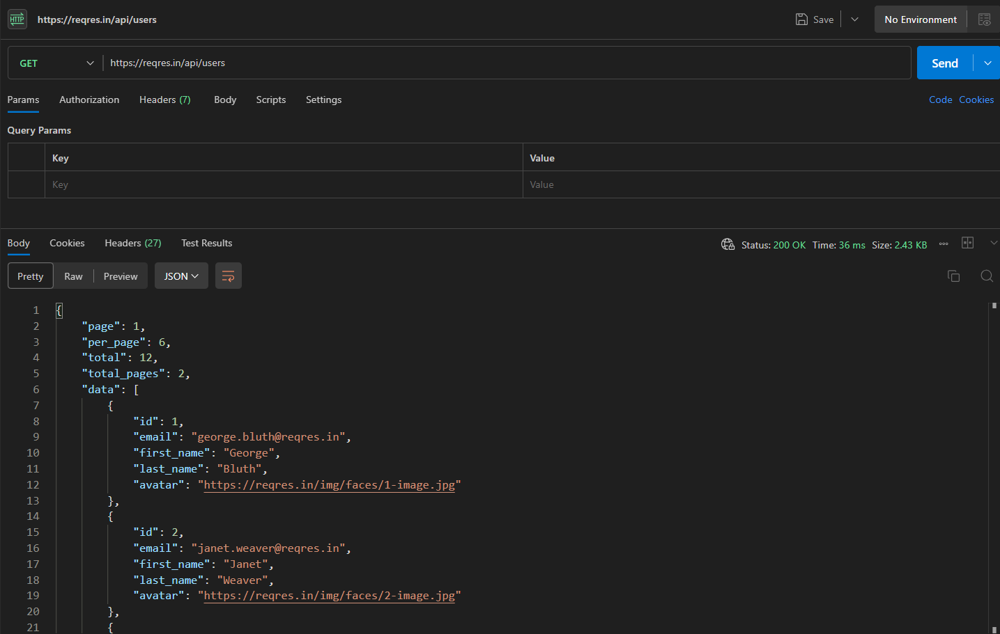
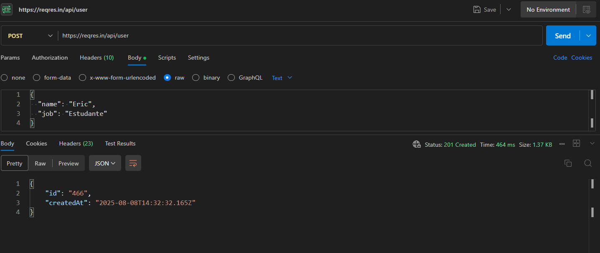

## ✅ Atividade: Explorando Métodos HTTP em APIs REST
Curso: Técnico em Desenvolvimento de Sistemas,
Formato: Em Markdown com explicações,
API utilizada: https://reqres.in/

## 🌐 GET – Buscar lista de usuários
Descrição: Busca os usuários.
Método: GET,
URL: https://reqres.in/api/users,
Headers: Nenhum necessário,
Body: Não se aplica

Resposta:
---

 
     
    {
    "page": 1,
    "per_page": 6,
    "total": 12,
    "total_pages": 2,
    "data": [
       {
            "id": 1,
            "email": "george.bluth@reqres.in",
            "first_name": "George",
            "last_name": "Bluth",
            "avatar": "https://reqres.in/img/faces/1-image.jpg"
        },

        {
            "id": 2,
            "email": "janet.weaver@reqres.in",
            "first_name": "Janet",
            "last_name": "Weaver",
            "avatar": "https://reqres.in/img/faces/2-image.jpg"
        },

        {
            "id": 3,
            "email": "emma.wong@reqres.in",
            "first_name": "Emma",
            "last_name": "Wong",
            "avatar": "https://reqres.in/img/faces/3-image.jpg"
        },

        {
            "id": 4,
            "email": "eve.holt@reqres.in",
            "first_name": "Eve",
            "last_name": "Holt",
            "avatar": "https://reqres.in/img/faces/4-image.jpg"
        },

        {
            "id": 5,
            "email": "charles.morris@reqres.in",
            "first_name": "Charles",
            "last_name": "Morris",
            "avatar": "https://reqres.in/img/faces/5-image.jpg"
        },

        {
            "id": 6,
            "email": "tracey.ramos@reqres.in",
            "first_name": "Tracey",
            "last_name": "Ramos",
            "avatar": "https://reqres.in/img/faces/6-image.jpg"
        }
    ],

    "support": {
        "url": "https://contentcaddy.io?utm_source=reqres&utm_medium=json&utm_campaign=referral",
        "text": "Tired of writing endless social media content? Let Content Caddy generate it for you."
    } }

Print: 

---

## 📝 POST – Criar novo usuário
Descrição: Cria um novo usuário fictício.
Método: POST,
URL: https://reqres.in/api/users,
Headers: Content-Type: application/json,
Body (JSON): {
  "name": "Eric",
  "job": "Estudante"
},

Resposta:

{
    "id": "466",
    "createdAt": "2025-08-08T14:32:32.165Z"
}

Print:

## 🔄 PUT – Atualizar dados de usuário
Descrição: Atualiza os dados de um usuário existente.
Método: PUT,
URL: https://reqres.in/api/users/2,
Headers: Content-Type: application/json,
Body: {
  "name": "Eric",
  "job": "Dev Júnior"
},

Resposta: 

{
    "updatedAt": "2025-08-08T14:37:22.497Z"
}

Print: 

.png)

## ❌ DELETE – Remover usuário
Descrição: Remove um usuário específico.
Método: DELETE,
URL: https://reqres.in/api/users/2,
Headers: Nenhum necessário,
Body: Não se aplica,

Resposta: 

Código HTTP: 204 No Content

Corpo: vazio

Print:

.png)
